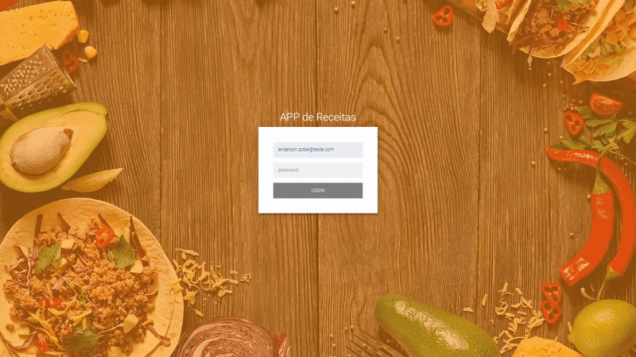

# [FrontEnd] Receitas-app
## Desenvolvimento:
- Projeto Final de Front-end realizdo na [Trybe](https://www.betrybe.com/) 
- Realizado em grupo e pair programming
- Integrantes do Grupo: 
&ensp;[Anderson Zobel](https://github.com/Anderson-Zobel) 
&ensp;[Arthur Lisboa](https://github.com/Lisboaarthur) 
&ensp;[Daniel Tavares](https://github.com/dev-tavares) 
&ensp;[Luan Vitor](https://github.com/LuanVittor) 

## Habilidades
 - Optar por usar _Redux_ ou _Context API_ para gerenciar estado
 - Utilizar a biblioteca _React-Redux_ (caso _Redux_ seja sua escolha)
 - Utilizar o _React Hook useState_
 - Utilizar o _React Hook useContext_
 - Utilizar o _React Hook useEffect_
 - Criar Hooks customizados

## Deploy
 - [Receitas-APP](receitas-app-pied.vercel.app)

## Preview do Projeto

